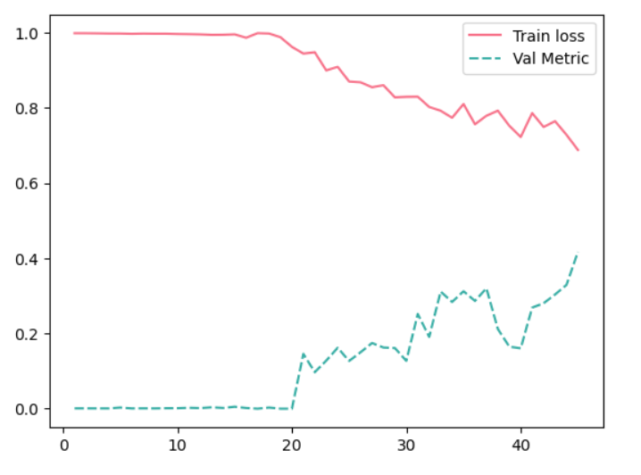
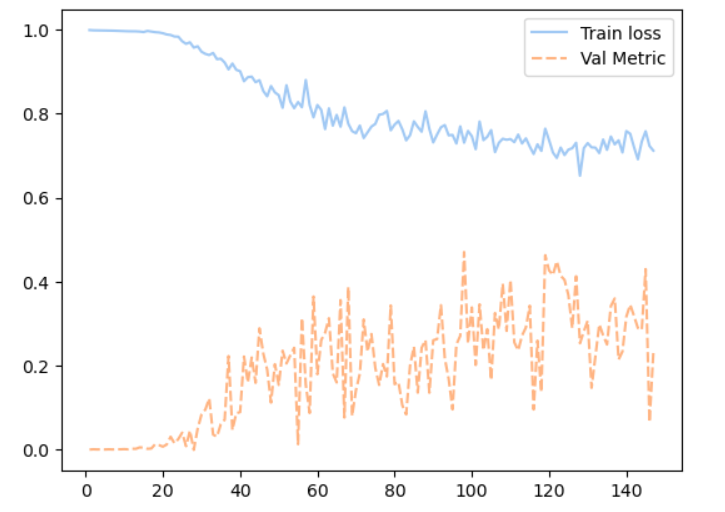
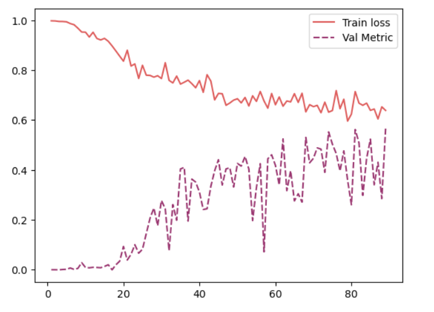

# Lung Tumor Segmentation

This project aims to develop an accurate and efficient lung segmentation model for medical image analysis using three models: Swin-UNetR, UNetR, and UNet. The models were trained on the Decathlon Lung dataset and then ensembled to improve segmentation accuracy. Additionally, each model was trained on two different processed datasets, where one dataset had image intensities capped and the other dataset did not.

## Dataset

The [Decathlon Lung CT Segmentation dataset](https://drive.google.com/file/d/1I1LR7XjyEZ-VBQ-Xruh31V7xExMjlVvi/view?usp=share_link) is a public dataset that is widely used for research in medical image segmentation, specifically for lung tumor segmentation in CT scans. The dataset contains CT images from 96 patients, divided into **64 training** cases and **32 testing** cases. The images are provided in NifTI format. The dataset also contains corresponding masks for lung segmentation, which are provided in NifTI format. The dataset includes **20 images** that were obtained from the [NSCLC radiogenomics dataset](https://wiki.cancerimagingarchive.net/display/Public/NSCLC-Radiomics), which were used to train the models. You can download dataset from [here](https://drive.google.com/file/d/1yU_MeDoMHnLg0vNAy4Hb7_liJBogWl_N/view?usp=share_link).

## Models

### 1. UNet

[UNet](https://link.springer.com/chapter/10.1007/978-3-319-24574-4_28) is a popular and widely used architecture for medical image segmentation. It consists of an encoder and a decoder network, with skip connections between them. The encoder network gradually reduces the spatial resolution of the image while increasing the number of feature channels, and the decoder network gradually recovers the spatial resolution while decreasing the number of feature channels. The skip connections allow the decoder to combine the high-level semantic information from the encoder with the low-level spatial information from the image.

|  |
|:--:|
|*Figure 1: UNet Architecture*|

### 2. UNetR

[UNeTR](https://ieeexplore.ieee.org/document/9706678/authors#authors) is a variant of UNet that uses transformer as encoder to improve the high variability and complexity of medical images. This architecture has been shown to outperform the original UNet in several medical image segmentation tasks.

|  |
|:--:|
|*Figure 2: UNeTR Architecture*|

### 3. Swin-UNetR

[Swin-UNetR](https://ieeexplore.ieee.org/document/9879123) is a recently proposed architecture that combines the Swin Transformer with the UNetR architecture for medical image segmentation. The Swin Transformer allows for more efficient processing of long-range dependencies in the image, while the UNetR architecture allows for accurate segmentation.

|  |
|:--:|
|*Figure 3: Swin-UNeTR Architecture*|

## Data Preprocessing

The dataset was preprocessed by rescaling the intensity values to the range [-1, 1]. Additionally, two sets of preprocessed data were generated, where one set had the intensity values capped between [-200, 200] and the other set did not have intensity values capped. As dataset is small so different data augmentation techniques were used to increase the size of the dataset, such as random rotation, random noise.

## Training

Each model was trained on both sets of preprocessed data using a [dice](https://ieeexplore.ieee.org/document/9277638) loss function and the Adam optimizer. The learning rate was set to 0.001, and the models were trained for 100 epochs with a batch size of 1. Learning rate schedules was used to adjust the learning rate during training by reducing the learning rate according to epoch.

## Ensemble

The three models were ensembled by averaging the output probabilities of each model. This approach has been shown to improve segmentation accuracy and reduce overfitting.

## Output

|  |
|:--:|
|*Figure 1: UNet training loss and dice score*|

|  |
|:--:|
|*Figure 2: UNeTR training loss and dice score*|

|  |
|:--:|
|*Figure 3: Swin-UNeTR training loss and dice score*|

|  |
|:--:|
|*Figure 4: Output of the ensembled model*|

## How To Use?

```bash
# Clone this repository
$ git clone 

# download dataset from 
# https://drive.google.com/file/d/1yU_MeDoMHnLg0vNAy4Hb7_liJBogWl_N/view?usp=share_link
# create data folder in root directory
$ mkdir data

# unzip dataset in data folder
$ unzip data.zip -d data

# open jupyter notebook
$ jupyter-notebook

# open any-file.ipynb
```

## 🔧 Tools and Technology

- 
- 
- 
- 
- 
- 
- 
- 
  
## 📝 License

This project is licensed under the MIT License - see the [LICENSE](LICENSE) file for details.

## Conclusion

In this project, we developed a lung segmentation model using three different architectures and two sets of preprocessed data. The ensembled model achieved the highest segmentation accuracy on the dataset. The results demonstrate the effectiveness of ensembling models and the potential of Swin-UNetR, UNeTr and UNet for medical image segmentation tasks.
